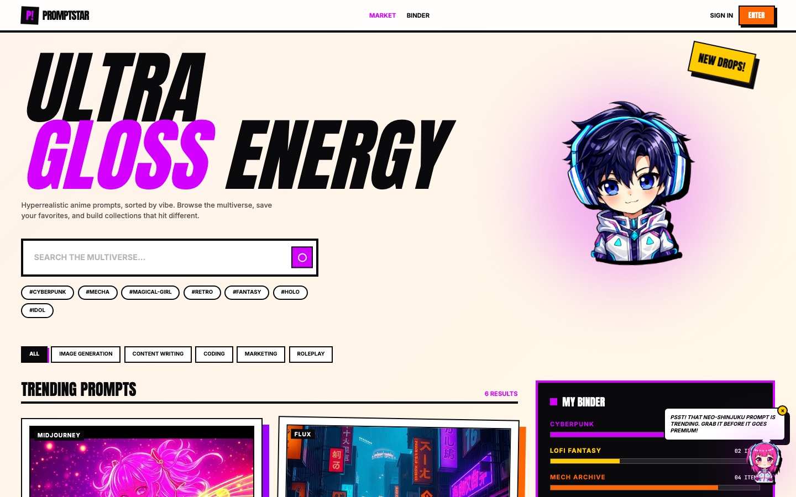
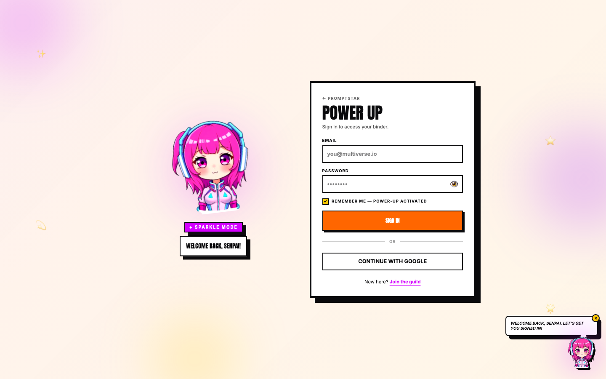
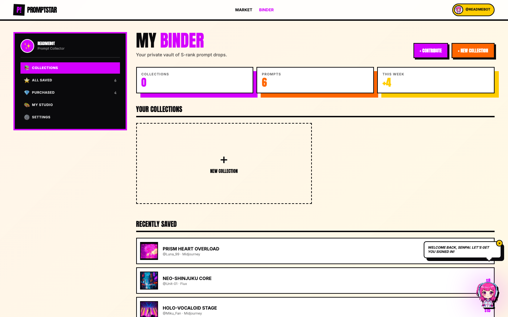
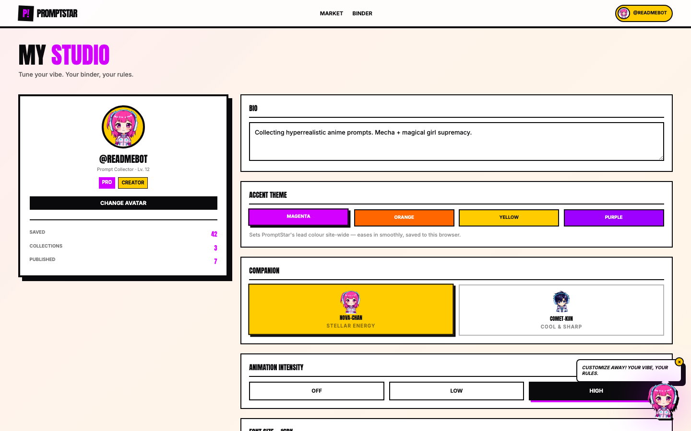
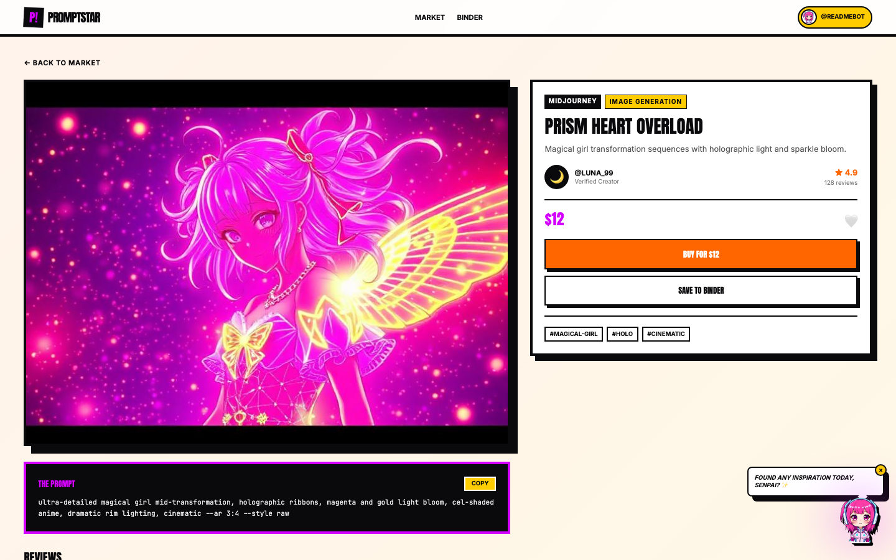
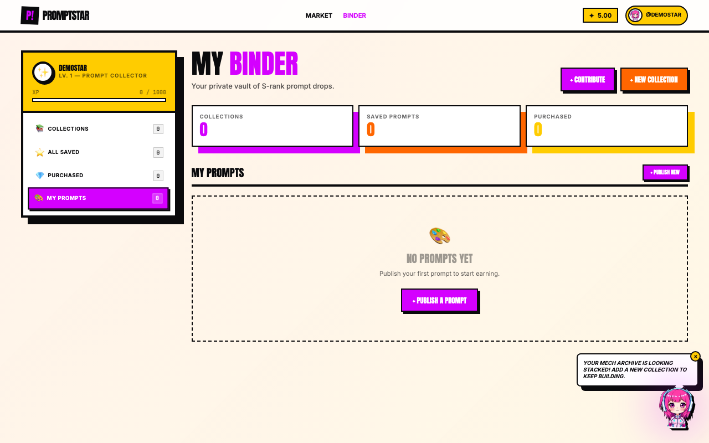
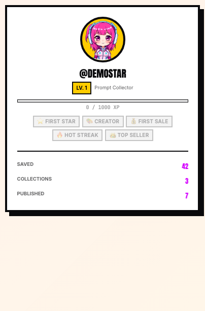
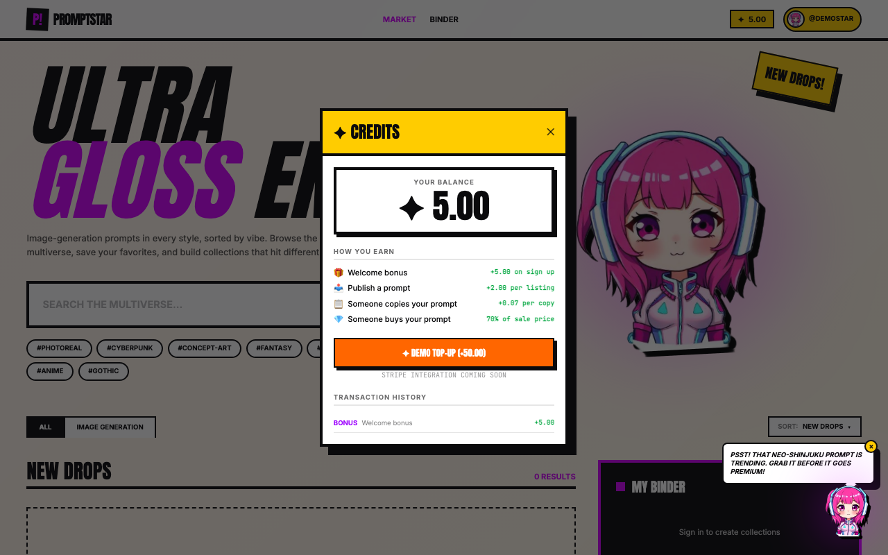

# PromptStar ✨

**A pop-idol-holo styled marketplace for AI image-generation prompts** — browse, save, collect, and publish prompts in a loud, neon, sticker-bomb aesthetic. Built as a full-stack TanStack Start app with its own auth, database, credit economy, gamification, creator tools, and an admin back-office.



---

## ✨ Features

- **Market** — browse trending and community-published prompts, sort by newest / trending / price / rating, filter by category
- **Binder** (dashboard) — your private vault: saved prompts, purchases, your own published prompts, and custom collections you can name and organise
- **Studio** (profile) — customize your avatar/companion mascot, accent theme color, animation intensity, bio, and font size
- **Prompt detail pages** — full write-ups with creator credit, pricing, copy count, view count, reviews, and buy/copy actions
- **Auth** — email/password sign-up and sign-in with bcrypt-hashed passwords, secure HTTP-only sessions, and brute-force rate limiting
- **Creator tools** — contribute your own prompt listings, edit them, track views and saves from your Binder
- **Credit economy** — new accounts get a welcome bonus, publishing earns a small bonus, buying a prompt pays the author a majority share, and copying a free prompt earns the author a micro-commission
- **Gamification** — XP and level system based on listings published, sales made, saves received, and reviews written, with unlockable badges shown on your Studio card
- **Reviews** — buyers can leave a star rating + written review on any prompt they've purchased (one review per purchase, enforced server-side)
- **Collections** — group saved prompts into named collections with a custom color and vibe tag; add or remove prompts, delete collections, share public collections
- **Reporting & moderation** — flag listings for review (NSFW, spam, stolen content, etc.); repeat reports auto-flag a listing for admin attention
- **Admin dashboard** — analytics, moderation queue, user management, financial controls, and an immutable audit log (see [below](#-admin-dashboard))
- **Live theming** — pick an accent color in Studio and the whole site repaints instantly, persisted across refreshes with zero flash-of-default-theme
- **Idle mascot companion** — a floating, animated buddy that follows you around the site
- **In-app dialogs & toasts** — every confirmation and status message uses themed `AlertDialog`/`sonner` components, never a native browser popup
- **Mobile-first** — full hamburger navigation on small screens, responsive at 375 / 768 / 1280 px

| Sign in | Binder | Studio |
|---|---|---|
|  |  |  |

### Prompt detail



### Progression & wallet

| My Prompts (Binder) | Profile card — XP & badges |
|---|---|
|  |  |

| Credits widget | Top-up panel |
|---|---|
|  |  |

---

## 🛠 Tech stack

- **[TanStack Start](https://tanstack.com/start)** + **[TanStack Router](https://tanstack.com/router)** — full-stack React framework with file-based routing, SSR, and server functions
- **[TanStack Query](https://tanstack.com/query)** — data fetching and session caching across navigations
- **React 19** + **TypeScript**
- **Tailwind CSS v4**
- **[Motion](https://motion.dev)** (Framer Motion) — scroll reveals, idle animations, reduced-motion support
- **PostgreSQL** via `pg`, with hand-rolled SQL migrations, idempotent migration tracking, `SERIALIZABLE` transactions + row locking for all financial operations, and an append-only audit log
- **bcryptjs** — password hashing
- **Zod** — runtime validation for every server function input
- **isomorphic-dompurify** — server-side sanitization of all user-submitted text
- **Radix UI** + **sonner** — accessible dialogs, toasts, and design-system primitives (shadcn-style)
- **Vite** — dev server and bundler
- **Docker** + **GitHub Actions** — CI/CD pipeline that builds and publishes `suhaasnv/promptstar` to Docker Hub on every push to `main`

---

## 🔒 Security

PromptStar's auth, financial, and admin paths follow industry-standard hardening practices:

- **Sessions** — random 32-byte tokens, stored server-side with expiry, set as `httpOnly`, `sameSite: strict`, and `secure` (HTTPS-only) in production
- **Passwords** — hashed with bcrypt (cost factor 10); never stored or exported in plaintext
- **Rate limiting** — sign-in attempts are throttled per email to blunt brute-force and credential-stuffing
- **Timing-safe auth** — sign-in always performs a password comparison, even for unknown emails, so response time can't be used to enumerate accounts
- **HTTP security headers** — Content-Security-Policy, `X-Frame-Options`, `X-Content-Type-Options`, `Referrer-Policy`, `Permissions-Policy`, and HSTS (in production) are applied to every response
- **SQL injection-safe** — every query is parameterized via `pg`; no string-concatenated SQL anywhere
- **XSS-safe** — all user-submitted text (bios, reviews, listing descriptions, report notes) is sanitized server-side before storage
- **IDOR-safe** — every mutation checks resource ownership (`WHERE id = $1 AND user_id = $2`) before acting
- **Financial integrity** — purchases, credit adjustments, and dispute resolutions run inside `SERIALIZABLE` transactions with row-level locking to prevent double-spends and race conditions
- **Audit trail** — every admin action is written to an append-only `audit_logs` table (database-enforced — rows can't be updated or deleted)
- **GDPR-aware** — account data export excludes password hashes; account deletion revokes all sessions transactionally

---

## 🧑‍💼 Admin dashboard

Gated behind an `is_admin` flag on the user's account, the admin dashboard (`/admin`) is a full back-office for running the marketplace:

| Tab | What it does |
|---|---|
| **Dashboard** | Revenue (24h/7d/30d), platform fees, active creators/buyers, total users, flagged listings, pending reports |
| **Reports** | Review user-submitted reports on listings, remove offending listings or dismiss reports |
| **Listings** | Search and moderate all published listings, filter by status |
| **Users** | Search users, view balance/listings/purchases/ratings, adjust user credit balances with a logged reason |
| **Financial** | Payout queue, dispute resolution, refunds — all run through `SERIALIZABLE` transactions |
| **Queue** | Newly flagged or pending-review listings awaiting moderation |
| **Audit** | Immutable, append-only log of every admin action ever taken |
| **Credits** | Platform-wide view of all credit transactions |

---

## 🐳 Running with Docker (recommended for collaborators)

No Node, Bun, or database setup required — just Docker Desktop.

```bash
# 1. Clone the repo
git clone https://github.com/SuhaasNv/anime-prompt-haven.git
cd anime-prompt-haven

# 2. Pull the latest image and start everything
docker compose pull
docker compose up
```

Open **http://localhost:3000** — the app and database start together; migrations run automatically on boot.

**To update to the latest version:**

```bash
docker compose pull && docker compose up
```

**To stop:**

```bash
docker compose down
```

> The `SESSION_SECRET` in `docker-compose.yml` defaults to `change-me-in-production`. For anything beyond local development, set it to a strong random string via an `.env` file or your environment.

---

## 💻 Local development (from source)

### Prerequisites

- [Bun](https://bun.sh) (v1.x) — `curl -fsSL https://bun.sh/install | bash`
- Docker Desktop (for the local Postgres database)

### 1. Install dependencies

```bash
bun install
```

### 2. Start the database

```bash
docker compose up -d postgres
```

### 3. Configure environment

```bash
cp .env.example .env
```

The defaults in `.env.example` connect to the Docker Postgres instance out of the box.

### 4. Run migrations

```bash
npm run db:migrate
```

### 5. Start the dev server

```bash
npm run dev
```

The app runs at **http://localhost:3000** — frontend, SSR, and server functions all from one process.

---

## 📜 Scripts

| Command | What it does |
|---|---|
| `npm run dev` | Start the dev server |
| `npm run build` | Production build (client + server) |
| `npm run preview` | Preview a production build locally |
| `npm run lint` | Run ESLint |
| `npm run format` | Format with Prettier |
| `npm run db:migrate` | Run pending SQL migrations against `DATABASE_URL` |

---

## 🎮 Gamification system

XP is earned passively as you use the platform:

| Action | XP earned |
|---|---|
| Publish a prompt listing | +100 XP |
| Make a sale | +500 XP |
| Receive a save on your listing | +50 XP |
| Write a review | +75 XP |

Every 1 000 XP = 1 level. Your current level and XP bar are shown on your Studio card.

**Badges** unlock at milestones and are displayed on your profile:

| Badge | Condition |
|---|---|
| ⭐ First Star | Receive your first save |
| 🎨 Creator | Publish your first listing |
| 💰 First Sale | Make your first sale |
| 🔥 Hot Streak | Receive 5 or more saves |
| 👑 Top Seller | Make 10 or more sales |

---

## 💳 Credit economy

- New accounts receive a **welcome bonus** of credits on sign-up
- **Publishing a listing** earns the author a small publish bonus
- **Buying a prompt**: credits are deducted from the buyer; the author receives **70 %**, the platform takes **30 %**
- **Copying a free prompt**: the original author earns a small copy commission, with a smaller platform fee
- Top up your balance at any time from the credits widget in the navbar (rate-limited to prevent abuse)

---

## 📁 Project structure

```
src/
  routes/            File-based routes — pages, loaders, head meta (incl. /admin)
  components/        Shared UI (Navbar, PromptCard, modals, mascot, credits widget)
  components/admin/  Admin dashboard tabs (Reports, Listings, Users, Financial)
  components/ui/     Design-system primitives (Radix UI based — dialogs, toasts, etc.)
  lib/               Server functions, auth, theme system, mascots, gamification
  lib/api/           createServerFn endpoints, grouped by domain
  styles.css         Tailwind entry + design tokens
db/
  migrations/        Versioned SQL migrations (tracked in schema_migrations table)
.github/
  workflows/         docker-publish.yml — builds and pushes image on every push to main
```

---

## 🎨 Design notes

PromptStar leans into a **pop-idol holo** look — thick black borders, hard drop shadows, neon gradients, and bouncy spring animations. The accent color (`--magenta`) is a single CSS custom property that can be re-pointed at runtime from the Studio page, repainting every `text-magenta` / `bg-magenta` / `ring-magenta` usage across the site without a full reload. Four accent options are available: Magenta, Orange, Yellow, and Purple.
